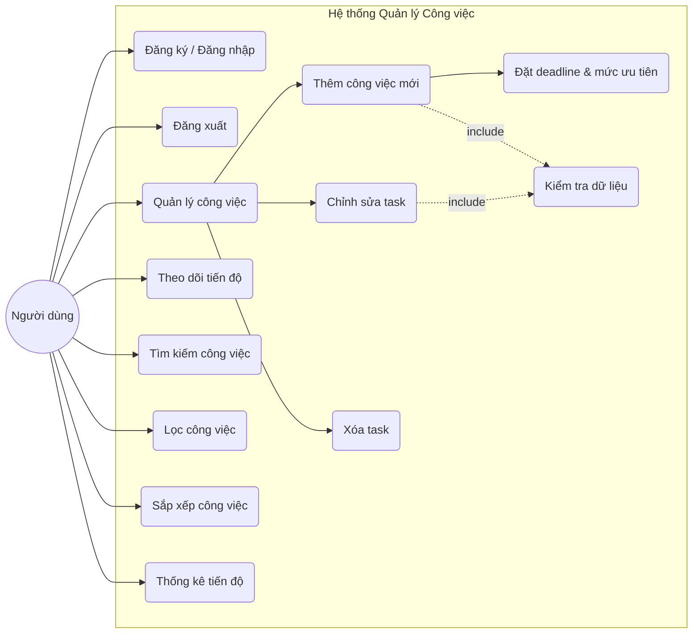
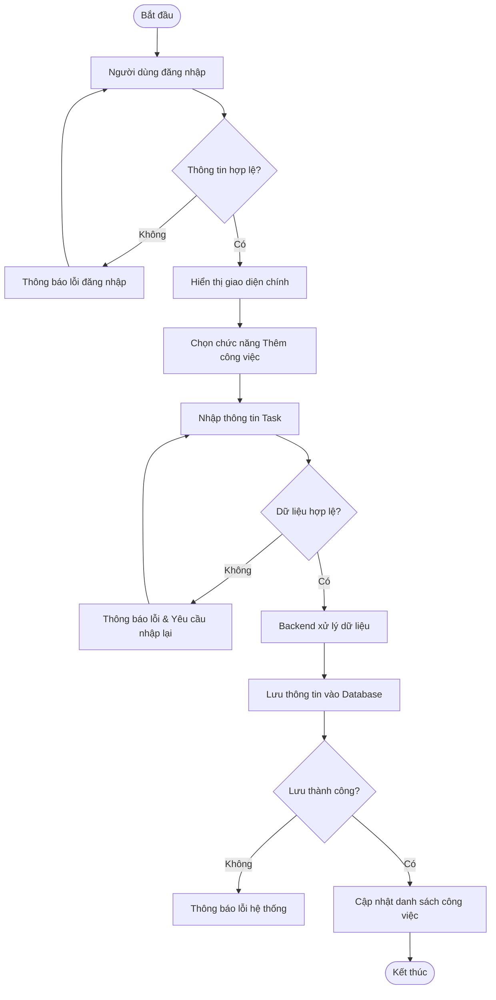
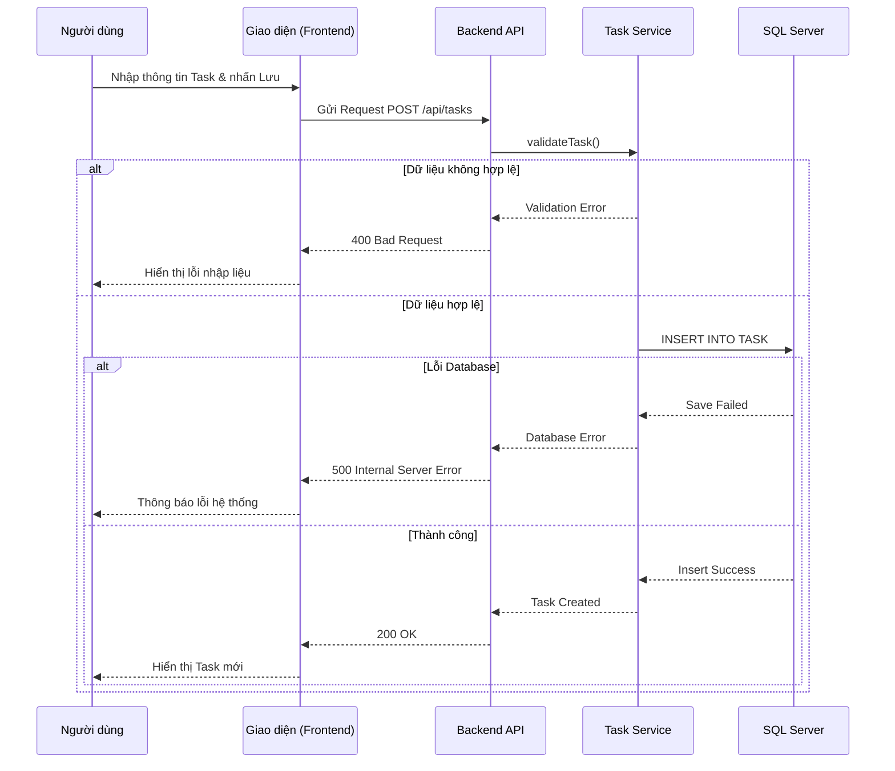
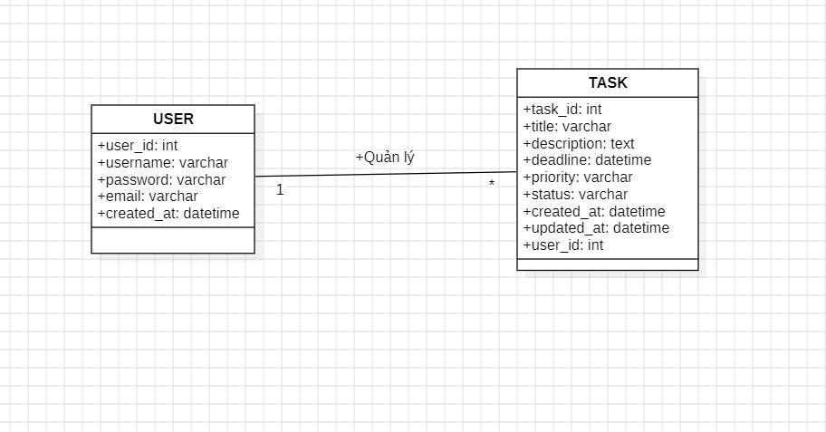
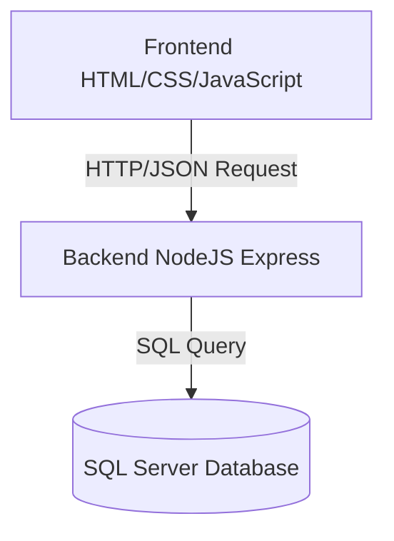

# PHÂN TÍCH HỆ THỐNG QUẢN LÝ VÀ THEO DÕI TIẾN ĐỘ CÔNG VIỆC CÁ NHÂN

---

# 1. Giới thiệu hệ thống

Hệ thống được xây dựng nhằm hỗ trợ người dùng quản lý thời gian và công việc cá nhân một cách khoa học.

Thông qua hệ thống, người dùng có thể tạo và quản lý danh sách công việc, theo dõi tiến độ thực hiện cũng như sắp xếp mức độ ưu tiên để nâng cao năng suất làm việc.

## Các tính năng cốt lõi

- Tạo và quản lý danh sách công việc (CRUD Task)
- Thiết lập thời hạn (Deadline) và mức độ ưu tiên
- Theo dõi trạng thái hoàn thành trực quan
- Tìm kiếm, lọc và sắp xếp công việc nhanh chóng
- Thống kê tiến độ công việc
- Đăng nhập và đăng xuất hệ thống

---

# 2. Yêu cầu hệ thống (Requirements)

## 2.1. Yêu cầu chức năng (Functional Requirements)

| Mã | Chức năng | Mô tả chi tiết |
|---|---|---|
| FR01 | Đăng ký / Đăng nhập | Tạo tài khoản và xác thực người dùng |
| FR02 | Thêm công việc | Tạo task mới với các thuộc tính: Tên, Mô tả, Deadline, Ưu tiên |
| FR03 | Quản lý task | Cho phép cập nhật hoặc xóa các task đã tồn tại |
| FR04 | Theo dõi tiến độ | Chuyển đổi trạng thái hoàn thành / chưa hoàn thành |
| FR05 | Tìm kiếm | Tìm kiếm nhanh task theo tên công việc |
| FR06 | Đăng xuất | Cho phép người dùng đăng xuất khỏi hệ thống |
| FR07 | Lọc công việc | Lọc task theo trạng thái hoặc mức độ ưu tiên |
| FR08 | Sắp xếp công việc | Sắp xếp task theo deadline hoặc mức ưu tiên |
| FR09 | Thống kê tiến độ | Hiển thị số lượng task đã hoàn thành và chưa hoàn thành |
---

## 2.2. Yêu cầu phi chức năng (Non-functional Requirements)

- Giao diện thân thiện, hiện đại và dễ sử dụng
- Hệ thống hoạt động tốt trên các trình duyệt web phổ biến
- Dữ liệu được lưu trữ an toàn trên SQL Server
- Phân quyền dữ liệu theo từng người dùng
- Tốc độ phản hồi nhanh cho các thao tác CRUD cơ bản

---

# 3. User Story

| STT | User Story |
|---|---|
| 1 | Người dùng muốn thêm công việc để không bỏ lỡ các nhiệm vụ quan trọng |
| 2 | Người dùng muốn đặt deadline để quản lý thời gian hiệu quả hơn |
| 3 | Người dùng muốn đánh dấu hoàn thành để theo dõi tiến độ công việc hàng ngày |
| 4 | Người dùng muốn tìm kiếm nhanh để quản lý danh sách task dễ dàng hơn khi số lượng lớn |
| 5 | Người dùng muốn lọc công việc để dễ dàng theo dõi các task quan trọng |
| 6 | Người dùng muốn sắp xếp công việc theo deadline để ưu tiên xử lý |
| 7 | Người dùng muốn xem thống kê tiến độ để đánh giá hiệu suất công việc |
| 8 | Người dùng muốn đăng xuất để bảo mật tài khoản cá nhân |

---

# 4. Sơ đồ Use Case (Use Case Diagram)

Biểu đồ mô tả các tương tác giữa Người dùng và các chức năng chính của hệ thống quản lý công việc cá nhân.

# 5. Use Case Description (Mô tả chi tiết)

## 5.1. Use Case: Đăng nhập hệ thống

- **Actor:** Người dùng  
- **Mô tả:** Người dùng đăng nhập vào hệ thống để truy cập và quản lý dữ liệu cá nhân  
- **Điều kiện trước:** Người dùng đã có tài khoản hợp lệ  
- **Điều kiện sau:** Hệ thống chuyển hướng đến giao diện quản lý công việc  
- **Input:** Tên đăng nhập (Username), Mật khẩu (Password)  
- **Output:** Hiển thị Dashboard quản lý công việc  
- **Luồng chính:**  
  1. Người dùng nhập tài khoản và mật khẩu  
  2. Hệ thống kiểm tra thông tin đăng nhập  
  3. Đăng nhập thành công và hiển thị giao diện chính  

- **Luồng ngoại lệ:**  
  - Sai tài khoản hoặc mật khẩu  
  - Tài khoản chưa tồn tại  

- **Exception:** Lỗi kết nối cơ sở dữ liệu  

---

## 5.2. Use Case: Thêm công việc

- **Actor:** Người dùng  
- **Mô tả:** Người dùng tạo mới một công việc để theo dõi tiến độ cá nhân  
- **Điều kiện trước:** Người dùng đã đăng nhập hệ thống  
- **Điều kiện sau:** Công việc được lưu vào cơ sở dữ liệu  
- **Input:** Tên công việc, mô tả, deadline, mức độ ưu tiên  
- **Output:** Hiển thị công việc mới trong danh sách task  
- **Luồng chính:**  
  1. Người dùng chọn chức năng thêm công việc  
  2. Nhập thông tin task  
  3. Hệ thống kiểm tra dữ liệu hợp lệ  
  4. Lưu dữ liệu vào Database  
  5. Hiển thị task mới lên giao diện  

- **Luồng ngoại lệ:**  
  - Thiếu thông tin bắt buộc  
  - Deadline không hợp lệ  

- **Exception:** Lỗi lưu dữ liệu hoặc lỗi hệ thống  

---

# 6. Biểu đồ hoạt động (Activity Diagram)

Biểu đồ mô tả luồng xử lý khi người dùng thực hiện thêm một nhiệm vụ mới vào hệ thống.

---

# 7. Biểu đồ trình tự (Sequence Diagram)

Biểu đồ mô tả quá trình tương tác giữa các thành phần trong hệ thống khi người dùng tạo mới một công việc.

---

# 8. Thiết kế cơ sở dữ liệu (ERD)

### Giải thích cơ sở dữ liệu

#### Bảng USER

Lưu trữ thông tin tài khoản người dùng của hệ thống.

| Tên trường | Kiểu dữ liệu | Ràng buộc | Mô tả |
|---|---|---|---|
| user_id | int | PK, Auto Increment | Mã người dùng |
| username | varchar | NOT NULL, UNIQUE | Tên đăng nhập |
| password | varchar | NOT NULL | Mật khẩu người dùng |
| email | varchar | NOT NULL, UNIQUE | Email tài khoản |
| created_at | datetime | DEFAULT CURRENT_TIMESTAMP | Thời gian tạo tài khoản |

---

#### Bảng TASK

Lưu trữ danh sách công việc của từng người dùng.

| Tên trường | Kiểu dữ liệu | Ràng buộc | Mô tả |
|---|---|---|---|
| task_id | int | PK, Auto Increment | Mã công việc |
| title | varchar | NOT NULL | Tên công việc |
| description | text | NULL | Mô tả chi tiết công việc |
| deadline | datetime | NOT NULL | Hạn hoàn thành |
| priority | varchar | NOT NULL | Mức độ ưu tiên |
| status | varchar | DEFAULT 'Pending' | Trạng thái công việc |
| created_at | datetime | DEFAULT CURRENT_TIMESTAMP | Ngày tạo task |
| updated_at | datetime | NULL | Ngày cập nhật gần nhất |
| user_id | int | FK | Liên kết người dùng |

---

### Mối quan hệ giữa các bảng

- Một người dùng có thể sở hữu nhiều công việc khác nhau.
- Mỗi công việc chỉ thuộc về một người dùng duy nhất.
- Quan hệ giữa USER và TASK là One-to-Many (1-N).

---

### Ràng buộc dữ liệu

- Username và Email không được trùng lặp.
- Deadline phải lớn hơn hoặc bằng thời gian hiện tại.
- Status chỉ nhận các giá trị:
  - Pending
  - Completed

- Priority chỉ nhận các giá trị:
  - Low
  - Medium
  - High

# 9. Kiến trúc hệ thống & Công nghệ

| Thành phần | Công nghệ sử dụng |
|---|---|
| Frontend | HTML5, CSS3, JavaScript (ES6+) |
| Backend | NodeJS (Express Framework) |
| Database | Microsoft SQL Server |
| Công cụ | GitHub, Visual Studio Code |

### Mô tả kiến trúc hệ thống

Hệ thống được xây dựng theo mô hình Client - Server:

- Frontend chịu trách nhiệm hiển thị giao diện và xử lý tương tác với người dùng.
- Backend xử lý logic nghiệp vụ và kết nối cơ sở dữ liệu.
- SQL Server lưu trữ toàn bộ dữ liệu người dùng và danh sách công việc.

# 10. Kết quả mong đợi

- Website hoạt động ổn định và hỗ trợ đầy đủ các thao tác quản lý công việc
- Người dùng có thể theo dõi tiến độ và deadline trực quan qua giao diện
- Hệ thống đảm bảo tính riêng tư dữ liệu cho từng tài khoản cá nhân
- Giao diện đơn giản, dễ sử dụng và dễ mở rộng trong tương lai

---

