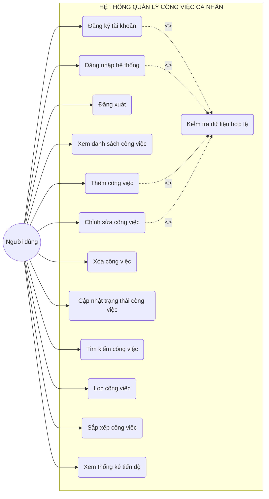
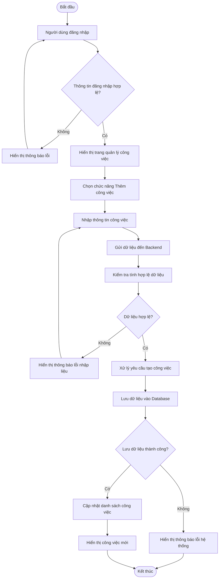
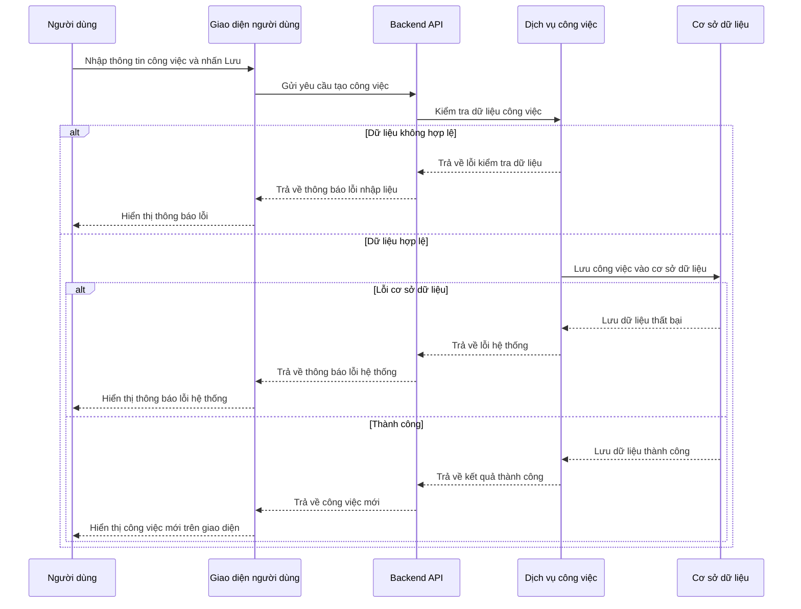
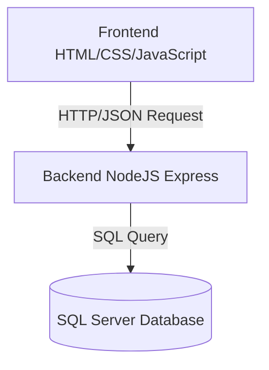

# PHÂN TÍCH HỆ THỐNG QUẢN LÝ VÀ THEO DÕI TIẾN ĐỘ CÔNG VIỆC CÁ NHÂN

# 1. Giới thiệu hệ thống

Hệ thống được xây dựng nhằm hỗ trợ người dùng quản lý thời gian và công việc cá nhân một cách khoa học.

Thông qua hệ thống, người dùng có thể tạo và quản lý danh sách công việc, theo dõi tiến độ thực hiện cũng như sắp xếp mức độ ưu tiên để nâng cao năng suất làm việc.

## Các tính năng cốt lõi

* Tạo và quản lý danh sách công việc (CRUD Task)
* Thiết lập thời hạn (Deadline) và mức độ ưu tiên
* Theo dõi trạng thái hoàn thành trực quan
* Tìm kiếm, lọc và sắp xếp công việc nhanh chóng
* Thống kê tiến độ công việc
* Đăng nhập và đăng xuất hệ thống

---

# 2. Yêu cầu hệ thống (Requirements)

## 2.1. Yêu cầu chức năng (Functional Requirements)

| Mã   | Chức năng               | Mô tả chi tiết                                           |
| ---- | ----------------------- | -------------------------------------------------------- |
| FR01 | Đăng ký                 | Tạo tài khoản mới với Username, Password và Email hợp lệ |
| FR02 | Đăng nhập               | Xác thực thông tin người dùng để truy cập hệ thống       |
| FR03 | Đăng xuất               | Cho phép người dùng kết thúc phiên làm việc an toàn      |
| FR04 | Xem danh sách công việc | Hiển thị toàn bộ danh sách công việc cá nhân             |
| FR05 | Thêm công việc          | Tạo task mới với Tên, Mô tả, Deadline và Mức ưu tiên     |
| FR06 | Chỉnh sửa công việc     | Cập nhật thông tin chi tiết của task                     |
| FR07 | Xóa công việc           | Xóa công việc khỏi hệ thống sau khi xác nhận             |
| FR08 | Cập nhật trạng thái     | Chuyển đổi trạng thái Pending / Completed                |
| FR09 | Tìm kiếm công việc      | Tìm kiếm task theo tiêu đề                               |
| FR10 | Lọc công việc           | Lọc task theo trạng thái hoặc mức ưu tiên                |
| FR11 | Sắp xếp công việc       | Sắp xếp task theo deadline hoặc mức ưu tiên              |
| FR12 | Thống kê tiến độ        | Thống kê số lượng và tỷ lệ công việc hoàn thành          |

---

## 2.2. Yêu cầu phi chức năng (Non-functional Requirements)

* Giao diện thân thiện, hiện đại và dễ sử dụng.
* Hệ thống hoạt động tốt trên các trình duyệt phổ biến.
* Dữ liệu được lưu trữ an toàn trên SQL Server.
* Người dùng chỉ được phép thao tác trên dữ liệu cá nhân của chính mình.
* Tốc độ phản hồi nhanh cho các thao tác cơ bản.
* Hệ thống xử lý ngoại lệ tốt và hiển thị thông báo lỗi rõ ràng.

---

# 3. User Story

| STT | User Story                                                                |
| --- | ------------------------------------------------------------------------- |
| 1   | Người dùng muốn thêm công việc để không bỏ lỡ các nhiệm vụ quan trọng     |
| 2   | Người dùng muốn đặt deadline để quản lý thời gian hiệu quả hơn            |
| 3   | Người dùng muốn đánh dấu hoàn thành để theo dõi tiến độ công việc         |
| 4   | Người dùng muốn tìm kiếm nhanh để quản lý danh sách công việc dễ dàng hơn |
| 5   | Người dùng muốn lọc công việc để theo dõi các task quan trọng             |
| 6   | Người dùng muốn sắp xếp công việc theo deadline để ưu tiên xử lý          |
| 7   | Người dùng muốn xem thống kê tiến độ để đánh giá hiệu suất làm việc       |
| 8   | Người dùng muốn đăng xuất để bảo mật tài khoản cá nhân                    |

---

# 4. Sơ đồ Use Case (Use Case Diagram)



---

# 5. Use Case Description

## 5.1. Use Case: Đăng nhập hệ thống

### Actor

Người dùng

### Mô tả

Người dùng đăng nhập vào hệ thống để truy cập dữ liệu cá nhân.

### Điều kiện trước

Người dùng đã có tài khoản hợp lệ.

### Điều kiện sau

Hệ thống xác thực thành công và chuyển hướng đến trang quản lý chính.

### Input

* Username
* Password

### Output

Hiển thị giao diện quản lý công việc cá nhân.

### Luồng xử lý chính

1. Người dùng truy cập trang đăng nhập.
2. Người dùng nhập Username và Password.
3. Hệ thống gửi yêu cầu xác thực.
4. Backend kiểm tra thông tin trong Database.
5. Hệ thống tạo phiên đăng nhập thành công.
6. Chuyển hướng đến trang quản lý chính.

### Luồng xử lý thay thế

* Người dùng bỏ trống thông tin:
  Hệ thống hiển thị thông báo:
  "Vui lòng nhập đầy đủ thông tin."

* Người dùng nhập sai tài khoản hoặc mật khẩu:
  Hệ thống hiển thị:
  "Tên đăng nhập hoặc mật khẩu không chính xác."

* Người dùng nhập sai mật khẩu quá nhiều lần:
  Hệ thống tạm khóa tài khoản trong 15 phút.

* Phiên đăng nhập hết hạn:
  Hệ thống yêu cầu người dùng đăng nhập lại.

### Ngoại lệ

* Lỗi kết nối cơ sở dữ liệu.
* Hệ thống không phản hồi.

---

## 5.2. Use Case: Đăng ký tài khoản

### Actor

Người dùng

### Mô tả

Người dùng tạo tài khoản mới để sử dụng hệ thống.

### Điều kiện trước

Người dùng chưa đăng nhập.

### Điều kiện sau

Thông tin tài khoản được lưu vào Database.

### Input

* Username
* Email
* Password
* Confirm Password

### Output

Hiển thị thông báo đăng ký thành công.

### Luồng xử lý chính

1. Người dùng nhập đầy đủ thông tin đăng ký.
2. Hệ thống kiểm tra dữ liệu hợp lệ.
3. Hệ thống kiểm tra Username và Email có tồn tại hay chưa.
4. Hệ thống mã hóa mật khẩu.
5. Lưu dữ liệu vào Database.
6. Chuyển hướng sang trang đăng nhập.

### Luồng xử lý thay thế

* Người dùng bỏ trống dữ liệu.
* Email không đúng định dạng.
* Password quá ngắn.
* Password xác nhận không khớp.
* Username hoặc Email đã tồn tại.

### Ngoại lệ

* Lỗi lưu dữ liệu.
* Mất kết nối Server.

---

## 5.3. Use Case: Thêm công việc

### Actor

Người dùng

### Mô tả

Người dùng tạo mới một công việc để theo dõi tiến độ.

### Điều kiện trước

Người dùng đã đăng nhập thành công.

### Điều kiện sau

Task mới được lưu thành công vào Database.

### Input

* Title
* Description
* Deadline
* Priority

### Output

Hiển thị công việc mới trên giao diện.

### Luồng xử lý chính

1. Người dùng chọn chức năng "Thêm công việc".
2. Hệ thống hiển thị form nhập dữ liệu.
3. Người dùng nhập thông tin công việc.
4. Hệ thống kiểm tra dữ liệu hợp lệ.
5. Backend lưu dữ liệu vào Database.
6. Cập nhật danh sách công việc trên giao diện.

### Luồng xử lý thay thế

* Title bị bỏ trống.
* Deadline nhỏ hơn thời gian hiện tại.
* Title vượt quá giới hạn ký tự.
* Người dùng nhập dữ liệu không hợp lệ.

### Ngoại lệ

* Không thể lưu dữ liệu vào Database.
* Lỗi kết nối hệ thống.

---

## 5.4. Use Case: Chỉnh sửa công việc

### Actor

Người dùng

### Mô tả

Người dùng chỉnh sửa thông tin công việc đã tồn tại.

### Điều kiện trước

Task cần chỉnh sửa phải thuộc quyền sở hữu của người dùng.

### Điều kiện sau

Thông tin task được cập nhật thành công.

### Luồng xử lý chính

1. Người dùng chọn chức năng chỉnh sửa.
2. Hệ thống hiển thị dữ liệu hiện tại.
3. Người dùng cập nhật thông tin.
4. Hệ thống kiểm tra dữ liệu hợp lệ.
5. Backend cập nhật dữ liệu vào Database.
6. Giao diện hiển thị dữ liệu mới.

### Luồng xử lý thay thế

* Title bị bỏ trống.
* Deadline không hợp lệ.

### Ngoại lệ

* Người dùng không có quyền chỉnh sửa task.
* Task không tồn tại.
* Lỗi cập nhật dữ liệu.

---

## 5.5. Use Case: Xóa công việc

### Actor

Người dùng

### Mô tả

Người dùng xóa công việc khỏi hệ thống.

### Điều kiện trước

Task tồn tại trong danh sách công việc.

### Điều kiện sau

Task bị xóa khỏi Database.

### Luồng xử lý chính

1. Người dùng chọn chức năng xóa.
2. Hệ thống hiển thị hộp thoại xác nhận.
3. Người dùng xác nhận xóa.
4. Hệ thống xóa dữ liệu trong Database.
5. Giao diện cập nhật danh sách công việc.

### Luồng xử lý thay thế

* Người dùng hủy thao tác xóa.

### Ngoại lệ

* Task không tồn tại.
* Người dùng không có quyền xóa task.
* Lỗi xóa dữ liệu trong Database.

```
```


# 6. Biểu đồ hoạt động (Activity Diagram)

Biểu đồ mô tả luồng xử lý khi người dùng thực hiện thêm một nhiệm vụ mới vào hệ thống.





---

# 7. Biểu đồ trình tự (Sequence Diagram)

Biểu đồ mô tả quá trình tương tác giữa các thành phần trong hệ thống khi người dùng tạo mới một công việc.





# 8. Thiết kế cơ sở dữ liệu (ERD)


# 8. Thiết kế cơ sở dữ liệu (ERD)

## 8.1. Giải thích cơ sở dữ liệu

Hệ thống sử dụng cơ sở dữ liệu quan hệ (Relational Database) với hai bảng chính gồm:

* USER: Lưu trữ thông tin tài khoản người dùng.
* TASK: Lưu trữ danh sách công việc của từng người dùng.

Mỗi người dùng có thể quản lý nhiều công việc khác nhau, đồng thời mỗi công việc chỉ thuộc về duy nhất một người dùng.

---

## 8.2. Bảng USER

Bảng USER dùng để lưu trữ thông tin tài khoản đăng nhập của người dùng trong hệ thống.

| Tên trường    | Kiểu dữ liệu  | Ràng buộc                 | Mô tả                   |
| ------------- | ------------- | ------------------------- | ----------------------- |
| user_id       | int           | PK, Auto Increment        | Mã người dùng           |
| username      | nvarchar(50)  | NOT NULL, UNIQUE          | Tên đăng nhập           |
| password_hash | nvarchar(255) | NOT NULL                  | Mật khẩu đã mã hóa      |
| email         | nvarchar(100) | NOT NULL, UNIQUE          | Email tài khoản         |
| created_at    | datetime      | DEFAULT CURRENT_TIMESTAMP | Thời gian tạo tài khoản |

---

## 8.3. Bảng TASK

Bảng TASK dùng để lưu trữ danh sách công việc của từng người dùng.

| Tên trường  | Kiểu dữ liệu  | Ràng buộc                 | Mô tả                    |
| ----------- | ------------- | ------------------------- | ------------------------ |
| task_id     | int           | PK, Auto Increment        | Mã công việc             |
| title       | nvarchar(100) | NOT NULL                  | Tên công việc            |
| description | nvarchar(MAX) | NULL                      | Mô tả chi tiết công việc |
| deadline    | datetime      | NOT NULL                  | Hạn hoàn thành           |
| priority    | nvarchar(20)  | NOT NULL                  | Mức độ ưu tiên           |
| status      | nvarchar(20)  | DEFAULT 'Pending'         | Trạng thái công việc     |
| created_at  | datetime      | DEFAULT CURRENT_TIMESTAMP | Ngày tạo công việc       |
| updated_at  | datetime      | NULL                      | Ngày cập nhật gần nhất   |
| user_id     | int           | FK                        | Liên kết người dùng      |

---

## 8.4. Mối quan hệ giữa các bảng

* Một USER có thể quản lý nhiều TASK khác nhau.
* Mỗi TASK chỉ thuộc về duy nhất một USER.

→ Quan hệ giữa USER và TASK là One-to-Many (1:N).

Khóa ngoại:

* TASK.user_id tham chiếu đến USER.user_id.

---

## 8.5. Ràng buộc dữ liệu (Business Rules & Constraints)

### Ràng buộc tài khoản

* Username không được trùng lặp.
* Email không được trùng lặp.
* Password phải được mã hóa trước khi lưu vào Database.

### Ràng buộc công việc

* Title không được để trống.
* Title tối đa 100 ký tự.
* Deadline phải lớn hơn hoặc bằng thời gian hiện tại.
* Mỗi task phải thuộc về một người dùng cụ thể thông qua user_id.

### Ràng buộc trạng thái (Status)

Status chỉ nhận một trong hai giá trị:

* Pending
* Completed

### Ràng buộc mức độ ưu tiên (Priority)

Priority chỉ nhận một trong ba giá trị:

* Low
* Medium
* High

---


# 9. Kiến trúc hệ thống & Công nghệ



| Thành phần | Công nghệ sử dụng |
|---|---|
| Frontend | HTML5, CSS3, JavaScript (ES6+) |
| Backend | NodeJS (Express Framework) |
| Database | Microsoft SQL Server |
| Công cụ | GitHub, Visual Studio Code |

### Mô tả kiến trúc hệ thống

Hệ thống được xây dựng theo mô hình Client - Server:

- Frontend chịu trách nhiệm hiển thị giao diện và xử lý tương tác với người dùng.
- Backend xử lý logic nghiệp vụ và kết nối cơ sở dữ liệu.
- SQL Server lưu trữ toàn bộ dữ liệu người dùng và danh sách công việc.

# 10. Kết quả mong đợi

- Website hoạt động ổn định và hỗ trợ đầy đủ các thao tác quản lý công việc
- Người dùng có thể theo dõi tiến độ và deadline trực quan qua giao diện
- Hệ thống đảm bảo tính riêng tư dữ liệu cho từng tài khoản cá nhân
- Giao diện đơn giản, dễ sử dụng và dễ mở rộng trong tương lai

---


