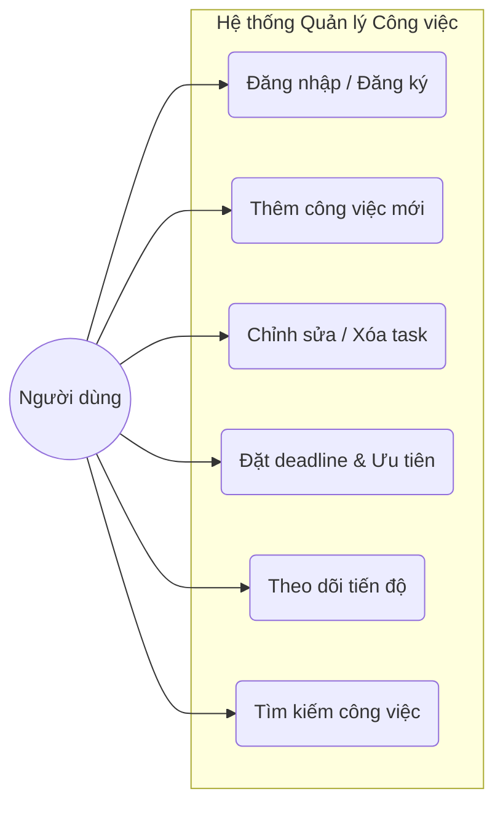
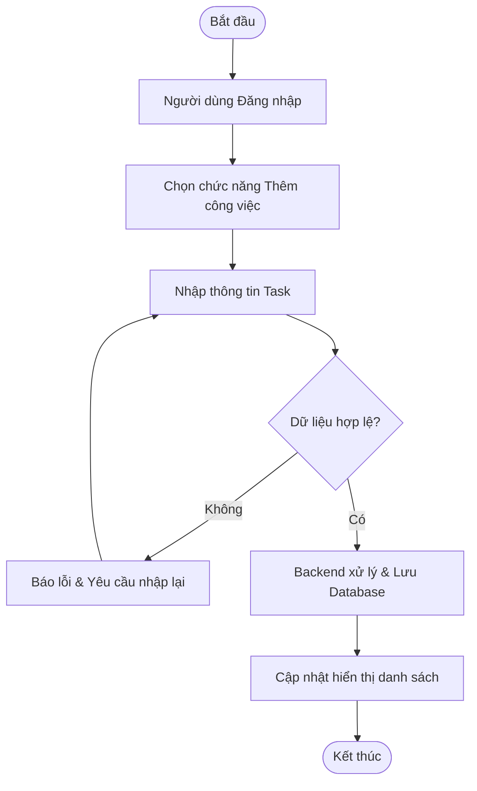
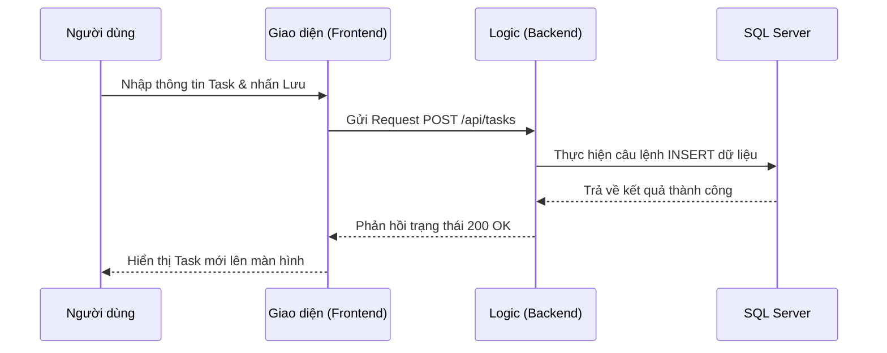
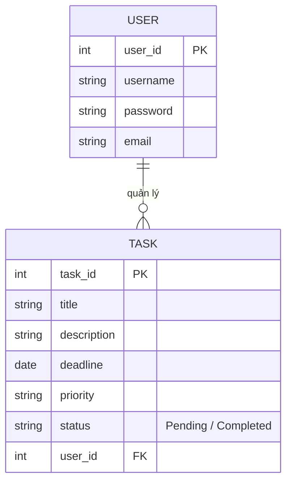
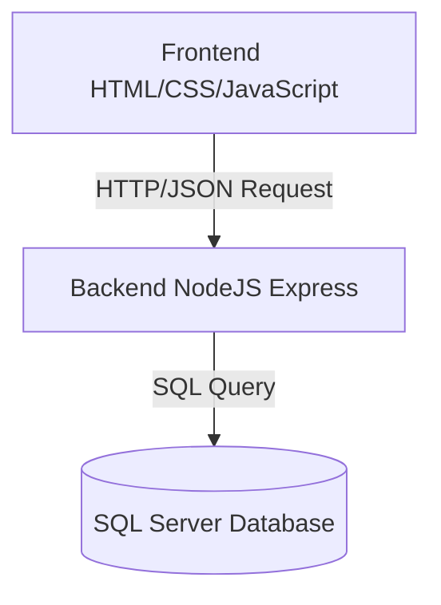

# PHÂN TÍCH HỆ THỐNG QUẢN LÝ VÀ THEO DÕI TIẾN ĐỘ CÔNG VIỆC CÁ NHÂN

---

# 1. Giới thiệu hệ thống

Hệ thống được xây dựng nhằm hỗ trợ người dùng quản lý thời gian và công việc cá nhân một cách khoa học.

Thông qua hệ thống, người dùng có thể tạo và quản lý danh sách công việc, theo dõi tiến độ thực hiện cũng như sắp xếp mức độ ưu tiên để nâng cao năng suất làm việc.

## Các tính năng cốt lõi
- Tạo và quản lý danh sách công việc (CRUD Task)
- Thiết lập thời hạn (Deadline) và mức độ ưu tiên
- Theo dõi trạng thái hoàn thành trực quan
- Tìm kiếm và lọc công việc nhanh chóng

---

# 2. Yêu cầu hệ thống (Requirements)

## 2.1. Yêu cầu chức năng (Functional Requirements)

| Mã | Chức năng | Mô tả chi tiết |
|---|---|---|
| FR01 | Đăng ký / Đăng nhập | Tạo tài khoản và xác thực người dùng |
| FR02 | Thêm công việc | Tạo task mới với các thuộc tính: Tên, Mô tả, Deadline, Ưu tiên |
| FR03 | Quản lý task | Cho phép cập nhật hoặc xóa các task đã tồn tại |
| FR04 | Theo dõi tiến độ | Chuyển đổi trạng thái hoàn thành / chưa hoàn thành |
| FR05 | Tìm kiếm | Tìm kiếm nhanh task theo tên công việc |

---

## 2.2. Yêu cầu phi chức năng (Non-functional Requirements)

- Giao diện thân thiện, hiện đại và dễ sử dụng
- Hệ thống hoạt động tốt trên các trình duyệt web phổ biến
- Dữ liệu được lưu trữ an toàn trên SQL Server
- Phân quyền dữ liệu theo từng người dùng
- Tốc độ phản hồi nhanh cho các thao tác CRUD cơ bản

---

# 3. User Story

| STT | User Story |
|---|---|
| 1 | Người dùng muốn thêm công việc để không bỏ lỡ các nhiệm vụ quan trọng |
| 2 | Người dùng muốn đặt deadline để quản lý thời gian hiệu quả hơn |
| 3 | Người dùng muốn đánh dấu hoàn thành để theo dõi tiến độ công việc hàng ngày |
| 4 | Người dùng muốn tìm kiếm nhanh để quản lý danh sách task dễ dàng hơn khi số lượng lớn |

---

# 4. Sơ đồ Use Case (Use Case Diagram)

Biểu đồ mô tả các tương tác giữa Người dùng và các chức năng chính của hệ thống.

---

# 5. Use Case Description (Mô tả chi tiết)

## 5.1. Use Case: Đăng nhập hệ thống

- **Actor:** Người dùng  
- **Mô tả:** Người dùng đăng nhập để truy cập dữ liệu cá nhân  
- **Input:** Tên đăng nhập (Username), Mật khẩu (Password)  
- **Output:** Chuyển hướng vào trang quản lý chính  
- **Exception:** Sai tài khoản hoặc mật khẩu  

---

## 5.2. Use Case: Thêm công việc

- **Actor:** Người dùng  
- **Mô tả:** Tạo một nhiệm vụ mới vào cơ sở dữ liệu  
- **Input:** Tên công việc, mô tả, deadline, mức độ ưu tiên  
- **Output:** Hiển thị công việc mới trong danh sách  
- **Exception:** Thiếu dữ liệu bắt buộc  

---

# 6. Biểu đồ hoạt động (Activity Diagram)

Mô tả luồng xử lý khi người dùng thực hiện thêm một nhiệm vụ mới vào hệ thống.

---

# 7. Biểu đồ trình tự (Sequence Diagram)

Mô tả quá trình tương tác giữa các lớp trong hệ thống khi tạo một task mới.

---

# 8. Thiết kế cơ sở dữ liệu (ERD)

---

# 9. Kiến trúc hệ thống & Công nghệ

| Thành phần | Công nghệ sử dụng |
|---|---|
| Frontend | HTML5, CSS3, JavaScript (ES6+) |
| Backend | NodeJS (Express Framework) |
| Database | Microsoft SQL Server |
| Công cụ | GitHub, Visual Studio Code |

---

# 10. Kết quả mong đợi

- Website hoạt động ổn định và hỗ trợ đầy đủ các thao tác quản lý công việc
- Người dùng có thể theo dõi tiến độ và deadline trực quan qua giao diện
- Hệ thống đảm bảo tính riêng tư dữ liệu cho từng tài khoản cá nhân
- Giao diện đơn giản, dễ sử dụng và dễ mở rộng trong tương lai

---

