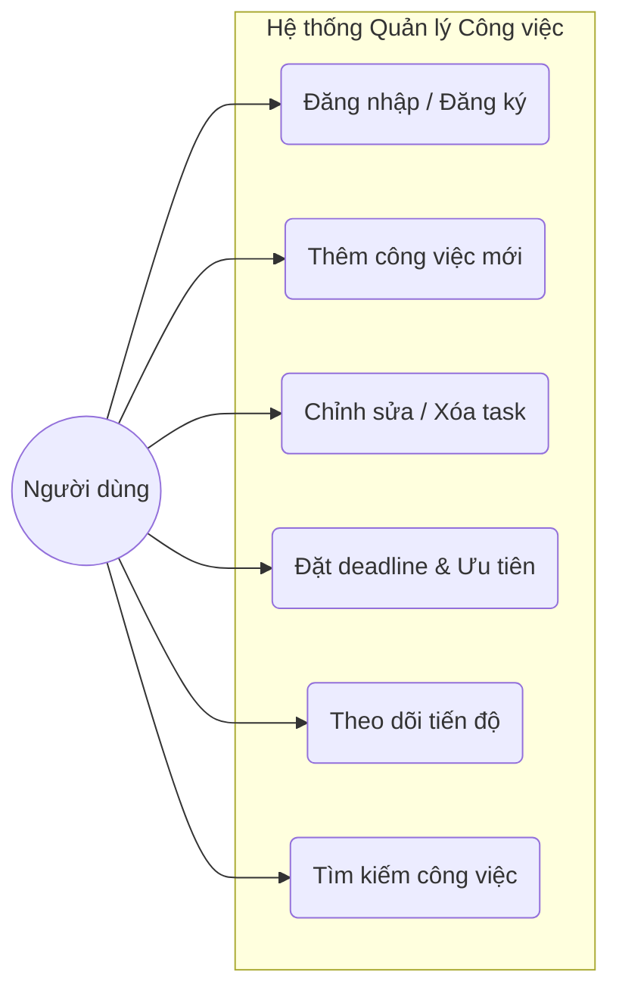
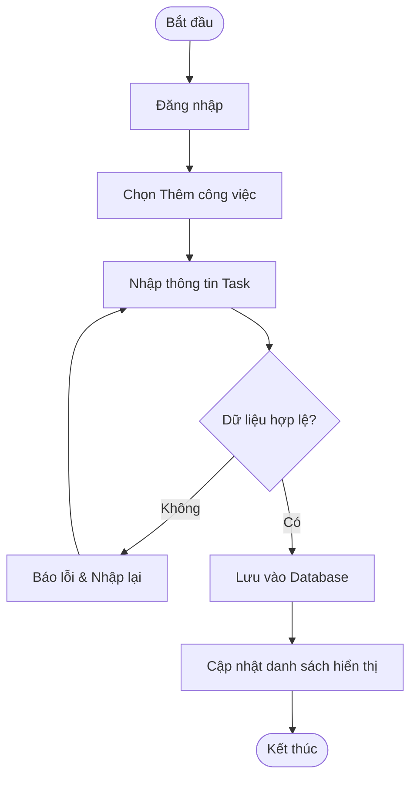
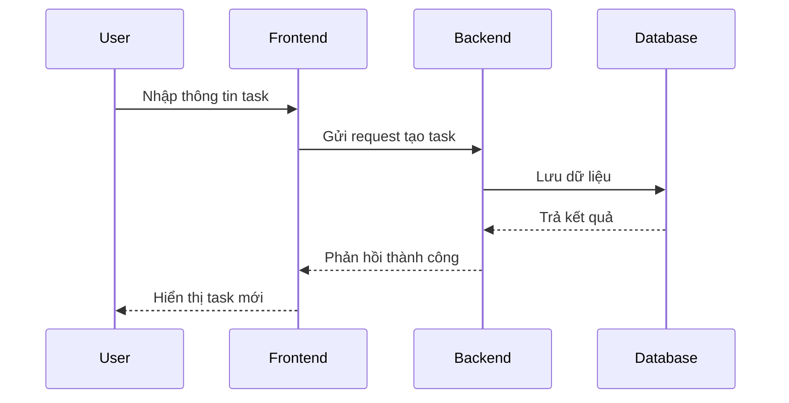
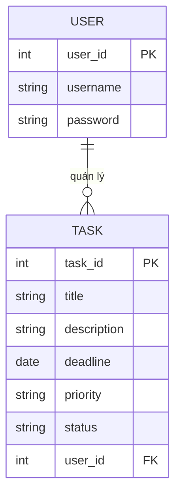
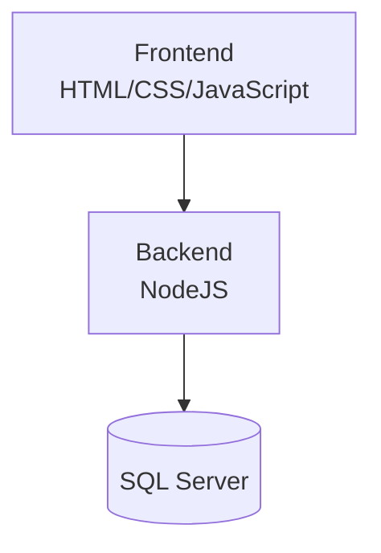

# PHÂN TÍCH HỆ THỐNG QUẢN LÝ VÀ THEO DÕI TIẾN ĐỘ CÔNG VIỆC CÁ NHÂN

---

# 1. Giới thiệu hệ thống

Hệ thống quản lý và theo dõi tiến độ công việc cá nhân được xây dựng nhằm hỗ trợ người dùng quản lý danh sách công việc, theo dõi tiến độ thực hiện và sắp xếp mức độ ưu tiên để nâng cao năng suất làm việc.

Hệ thống cho phép người dùng:
- Tạo và quản lý công việc cá nhân
- Thiết lập deadline cho từng task
- Theo dõi trạng thái hoàn thành
- Tìm kiếm và quản lý công việc hiệu quả

---

# 2. Yêu cầu hệ thống (Requirements)

## 2.1. Yêu cầu chức năng (Functional Requirements)

| Mã | Chức năng | Mô tả |
|---|---|---|
| FR01 | Đăng ký / Đăng nhập | Người dùng tạo và truy cập tài khoản |
| FR02 | Thêm công việc | Tạo task mới với tên, deadline và mức độ ưu tiên |
| FR03 | Quản lý task | Chỉnh sửa hoặc xóa các công việc đã tạo |
| FR04 | Theo dõi tiến độ | Đánh dấu hoàn thành và theo dõi trạng thái task |
| FR05 | Tìm kiếm công việc | Tìm kiếm task theo tên nhanh chóng |

---

## 2.2. Yêu cầu phi chức năng (Non-functional Requirements)

- Giao diện thân thiện, dễ sử dụng
- Dữ liệu được lưu trữ an toàn
- Tốc độ phản hồi nhanh
- Hệ thống hoạt động ổn định

---

# 3. User Story

| STT | User Story |
|---|---|
| 1 | Với vai trò là người dùng, tôi muốn đăng nhập để sử dụng hệ thống |
| 2 | Với vai trò là người dùng, tôi muốn thêm công việc để quản lý danh sách việc cần làm |
| 3 | Với vai trò là người dùng, tôi muốn đặt deadline để tránh quên công việc |
| 4 | Với vai trò là người dùng, tôi muốn chỉnh sửa công việc để cập nhật thông tin |
| 5 | Với vai trò là người dùng, tôi muốn đánh dấu hoàn thành để theo dõi tiến độ |
| 6 | Với vai trò là người dùng, tôi muốn tìm kiếm công việc để quản lý dễ dàng hơn |

---

# 4. Biểu đồ Use Case (Use Case Diagram)

Biểu đồ mô tả các chức năng mà người dùng có thể thực hiện trong hệ thống.

---

# 5. Use Case Description

## 5.1. Use Case: Đăng nhập

| Thành phần | Nội dung |
|---|---|
| Actor | Người dùng |
| Mô tả | Người dùng đăng nhập vào hệ thống |
| Tiền điều kiện | Người dùng đã có tài khoản |
| Input | Username, Password |
| Output | Truy cập thành công vào hệ thống |

---

## 5.2. Use Case: Thêm công việc

| Thành phần | Nội dung |
|---|---|
| Actor | Người dùng |
| Mô tả | Người dùng tạo task mới |
| Tiền điều kiện | Người dùng đã đăng nhập |
| Input | Tên công việc, deadline, mức độ ưu tiên |
| Output | Task mới được lưu vào hệ thống |

---

## 5.3. Use Case: Xóa công việc

| Thành phần | Nội dung |
|---|---|
| Actor | Người dùng |
| Mô tả | Người dùng xóa task khỏi hệ thống |
| Tiền điều kiện | Task tồn tại |
| Input | Task cần xóa |
| Output | Task bị xóa khỏi danh sách |

---

# 6. Biểu đồ hoạt động (Activity Diagram)

Quy trình khi người dùng thêm một công việc mới:

---

# 7. Sequence Diagram

Quy trình xử lý khi người dùng thêm công việc mới vào hệ thống:

---

# 8. Thiết kế cơ sở dữ liệu (ERD)

---

# 9. Kiến trúc hệ thống

---

# 10. Công nghệ sử dụng

| Thành phần | Công nghệ |
|---|---|
| Frontend | HTML, CSS, JavaScript |
| Backend | NodeJS |
| Database | SQL Server |
| Công cụ hỗ trợ | GitHub, Visual Studio Code |

---

# 11. Kết quả mong đợi

- Xây dựng thành công website quản lý công việc cá nhân
- Hỗ trợ đầy đủ chức năng CRUD công việc
- Theo dõi tiến độ và deadline hiệu quả
- Giao diện thân thiện và dễ sử dụng

---

# 12. Kết luận

Hệ thống quản lý và theo dõi tiến độ công việc cá nhân giúp người dùng quản lý công việc khoa học và hiệu quả hơn. Việc xây dựng hệ thống góp phần hỗ trợ theo dõi deadline, nâng cao năng suất làm việc và áp dụng kiến thức phân tích hệ thống vào thực tế.

---
